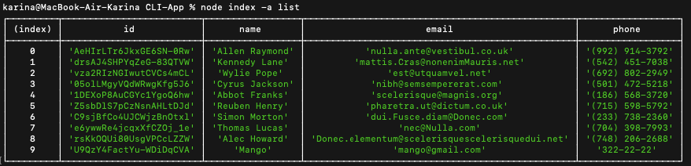
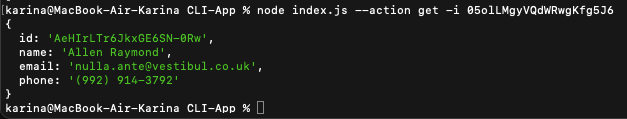
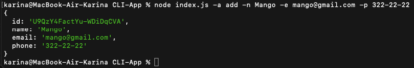
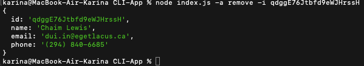

# CLI-App (Example Command-Line Application)

This is a simple command-line application (CLI) built using the `commander 11.0.0` package for easy parsing of command-line arguments. It is a demonstration app that allows processing some arguments passed from the command line and outputting the result to the console or saving it to a file `contacts.json` .

## Installation

1. Make sure you have Node.js installed (version 12 and above).

2. Clone the repository or download the zip:
   git clone https://github.com/andrii-doroshenko/CLI-App.git

3. Navigate to the project directory:
   cd CLI-App

4. Install the dependencies:
   <code>npm install or yarn install</code>
   > install nano.id varsion 3.3.4

## Usage

The application supports the following command-line arguments:

## Get and display the entire contact list in the form of a table (console.table)

<code>node index.js --action list</code>

## Get contact by id - output contact object to console or null if contact with such id does not exist.

<code>node index.js -a get -i 05olLMgyVQdWRwgKfg5J6</code>

## Add a contact and display the created contact in the console

<code>node index.js -a add -n Mango -e mango@gmail.com -p 322-22-22</code>

## Delete the contact and display the deleted contact in the console or null if the contact with this id does not exist.

<code>node index.js -a remove -i qdggE76Jtbfd9eWJHrssH</code>

## If the contact doesn't exist

